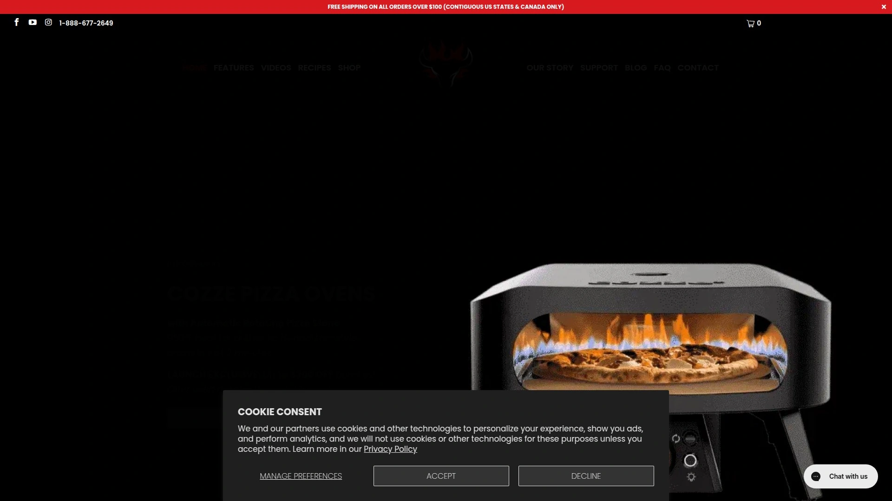
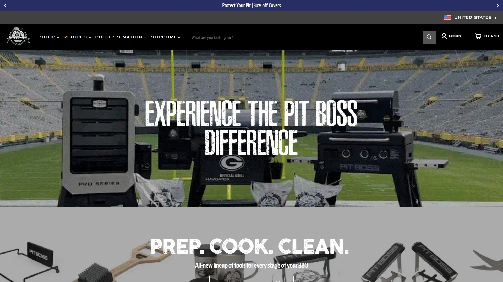
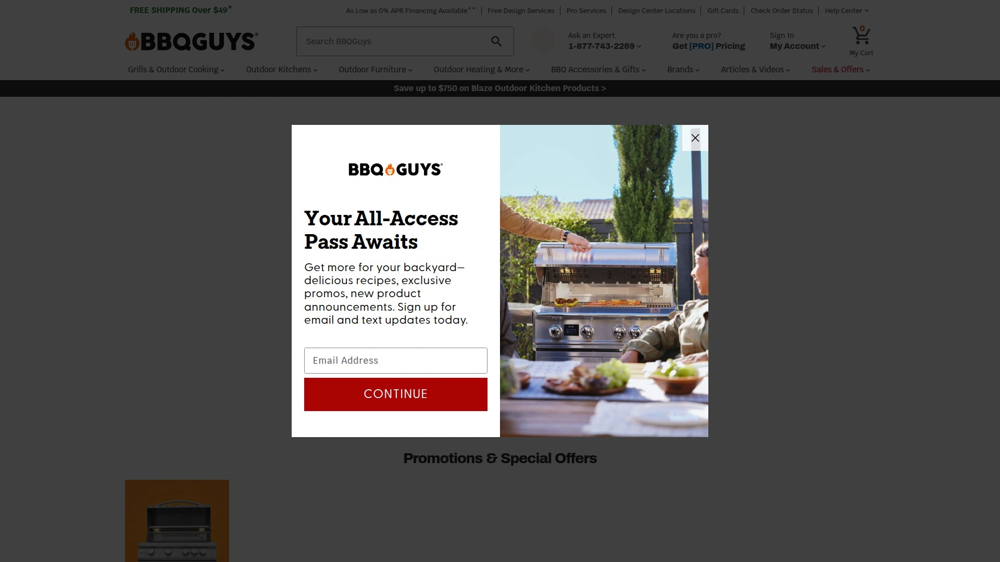
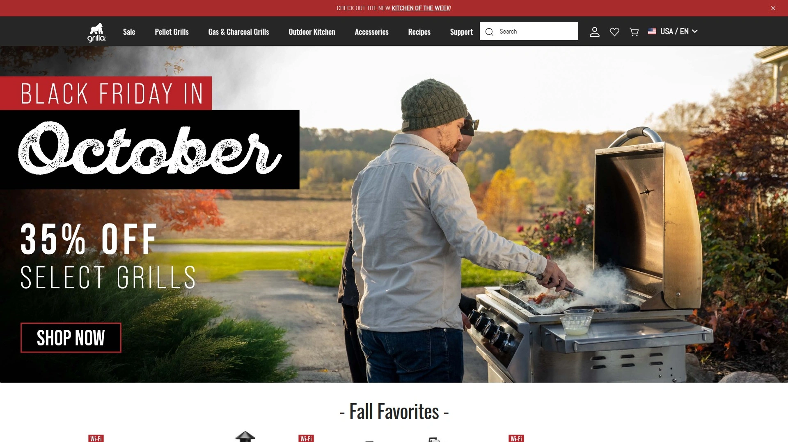
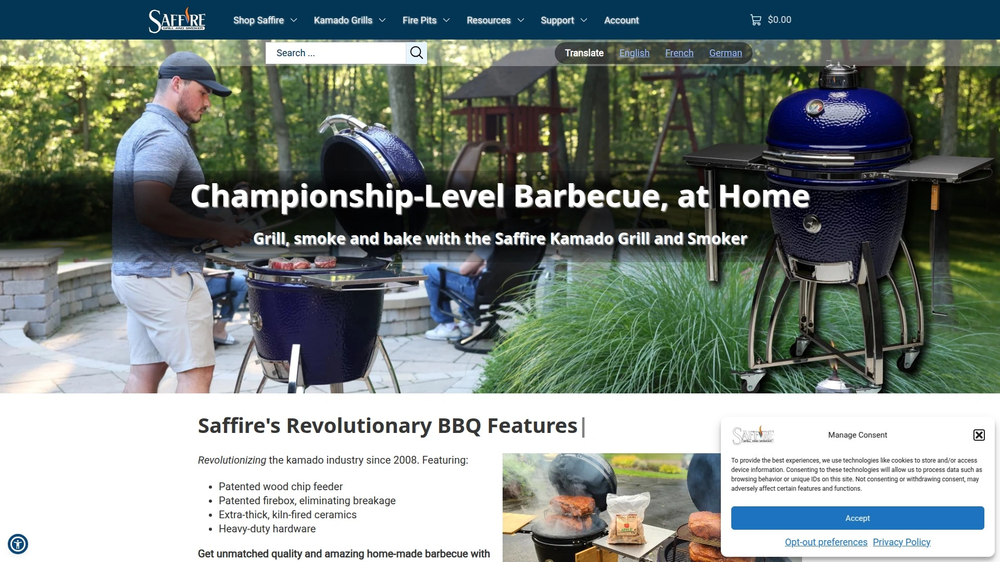
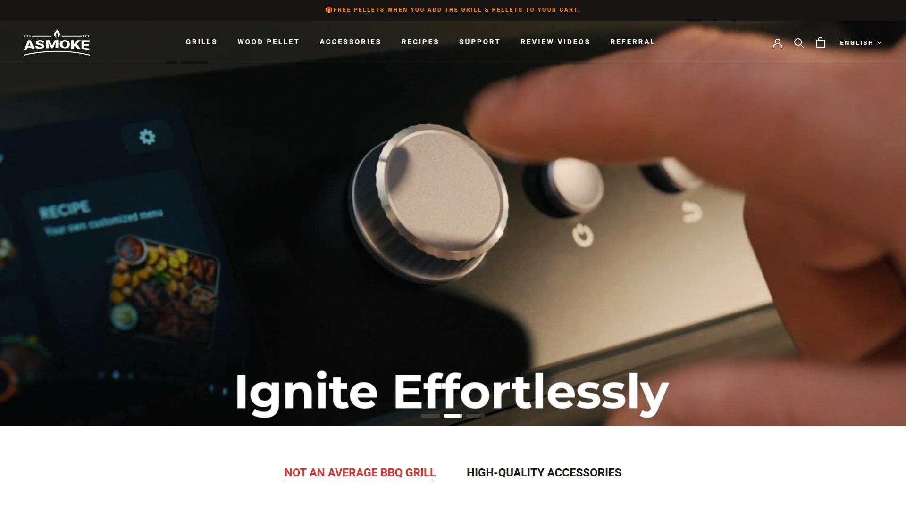
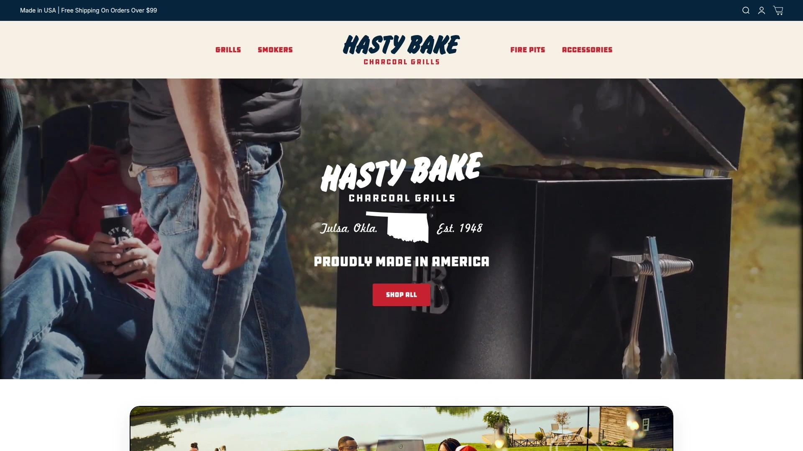
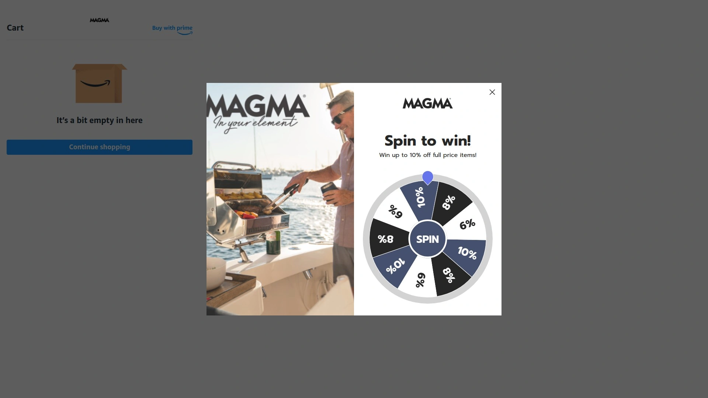
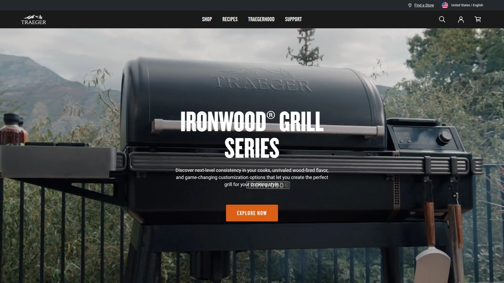
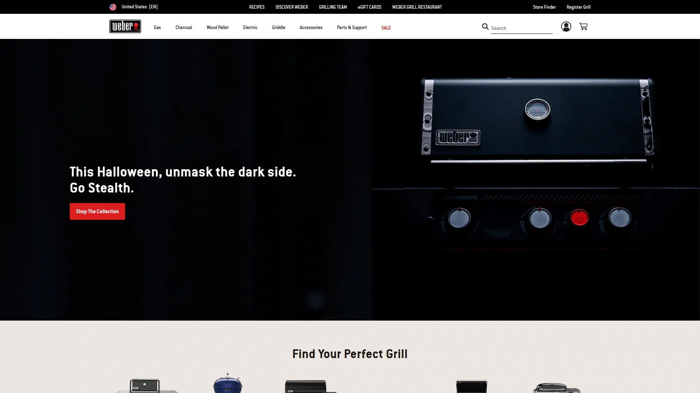

# 2025's Top 12 Best Portable Infrared Grills

Ever feel like your backyard grilling hits a wall at medium-rare? Standard grills struggle to deliver that perfect steakhouse crust without drying out the meat. Modern infrared technology changes everything, reaching temperatures up to 1500°F for restaurant-quality searing in under two minutes per side. These portable powerhouses bring professional-grade performance to your patio, tailgate, or camping spot without the bulk of traditional equipment.

## **[Schwank Grills](https://schwankgrills.com)**

Restaurant-quality 1500°F infrared searing anywhere.

Schwank Grills delivers the same overhead infrared salamander broiler technology used exclusively by top-tier steakhouses, now available for home use. The unit fires up instantly with a push-button igniter and reaches a scorching 1500°F in under three minutes. This extreme heat creates that coveted golden-brown crust while keeping the interior perfectly tender and juicy.

The overhead burner design eliminates flare-ups completely since flames never touch your food directly. Lower the adjustable grate after searing to finish cooking to your exact preferred doneness from rare to well-done. The drip tray below collects flavorful meat juices you can enhance with butter, spices, or oils for basting. Beyond steaks, this versatile unit handles pizza in five minutes, lobster tails in five minutes, and shrimp in just three minutes. Add the pizza stone accessory to transform it into a commercial-grade pizza oven. True portability means you can achieve professional results whether cooking at home or bringing it along to outdoor events.

## **[Pit Boss Grills](https://www.pitboss-grills.com)**

Wood pellet flavor meets cutting-edge smart technology.

Pit Boss brings authentic wood-fired flavor to the grilling experience through their extensive line of pellet grills, gas grills, and griddles. Their product range spans from compact portable models perfect for tailgating to full-size competition-grade units for serious pitmasters. The brand has built a reputation for delivering premium features at accessible price points compared to competitors.

Their pellet grills feature precise digital temperature control that maintains consistent heat for hours of hands-off smoking or high-temperature grilling. Many models include WiFi connectivity through their app, letting you monitor and adjust temperatures remotely. The versatility shines through 8-in-1 cooking capabilities including grilling, smoking, baking, roasting, braising, barbecuing, char-grilling, and searing. Heavy-gauge steel construction with porcelain-coated cast iron grates ensures durability through years of outdoor use.

## **[BBQGuys](https://www.bbqguys.com)**

Massive selection with over 100,000 outdoor living products.

BBQGuys operates as a comprehensive destination for everything outdoor cooking related, carrying major brands alongside their own exclusive lines. Their inventory spans gas grills, charcoal grills, pellet smokers, pizza ovens, outdoor refrigeration, and complete outdoor kitchen components. The breadth of selection means finding exactly the right equipment for your specific needs and budget.

Beyond just selling products, BBQGuys provides extensive educational resources including buying guides, installation tutorials, and recipe collections. Their customer service team includes grilling experts who can guide you through product selection and answer technical questions. The average order value reflects their focus on quality equipment that lasts. Many products ship free, and their flexible payment options make upgrading your outdoor cooking setup more manageable.

## **[Grilla Grills](https://www.grillagrills.com)**

Premium pellet grills with made-in-USA quality.

Grilla Grills manufactures their pellet grills in Holland, Michigan, focusing on rugged construction and reliable performance. Their Silverbac series offers competition-grade capabilities with double-wall insulated steel construction that maintains steady temperatures even in cold weather. The thick steel body retains heat efficiently while using less fuel than thinner competitors.

Digital PID controllers provide precise temperature management ranging from low-and-slow smoking at 180°F up to high-heat grilling at 500°F. The generous cooking surface accommodates large family meals or party-sized batches. Their hopper systems hold enough pellets for extended cooking sessions without constant refilling. The brand emphasizes customer support with direct access to their team for troubleshooting or modifications. Their warranty coverage demonstrates confidence in build quality and longevity.

## **[Saffire Grills](https://saffiregrills.com)**

Ceramic kamado innovation with patented improvements.

Saffire has spent over 15 years developing ceramic kamado grills with truly revolutionary improvements backed by three patents. Their kamado series offers four different sizes to match your cooking needs, from compact models for small patios to large units for serious entertaining. The ceramic construction provides exceptional heat retention and even cooking temperatures that charcoal and gas grills struggle to match.

Unique features set Saffire apart from other kamado manufacturers. Their innovative designs make temperature control more precise and cleanup easier than traditional egg-style cookers. The thick ceramic walls maintain stable temperatures for hours with minimal fuel consumption. You can smoke low and slow at 225°F or sear steaks at 700°F+ on the same unit. The company recently launched a totally unique tabletop firepit that brings their ceramic expertise to a new category within outdoor living.

## **[Camp Chef](https://www.campchef.com)**

Outdoor cooking systems built for adventure.

Camp Chef specializes in portable cooking gear designed for camping, tailgating, and backyard use. Their product line includes pellet grills, flat top griddles, outdoor ovens, and modular stove systems. The focus on true portability means most units feature folding legs, wheels, and compact designs that fit in vehicles easily.

Their Woodwind pellet grills feature side sear boxes that add direct-flame grilling capability alongside the main pellet chamber. The slide and grill technology lets you expose food directly to flames when you want char marks. Digital temperature controls maintain consistent heat automatically. Their SmokePro series offers even more cooking capacity for larger groups. The company recently announced a multi-year collaboration with Guy Fieri for co-branded cooking equipment launching in coming months, uniting the Mayor of Flavortown with a leading outdoor cooking innovator.

## **[ASMOKE](https://asmokegrill.com)**

Advanced wood pellet technology with app control.

ASMOKE brings modern technology to traditional wood pellet smoking with their connected grills featuring app-based monitoring and control. Their units combine smoking, grilling, baking, and roasting capabilities in one system. The wood pellet fuel delivers authentic smoke flavor while the digital controls remove the guesswork from temperature management.

The ASMOKE app lets you set temperatures, monitor progress, and receive alerts from anywhere in your home. Built-in meat probes track internal temperatures accurately so you know exactly when food reaches perfect doneness. The pellet hopper capacity supports extended cooking sessions for large briskets or multiple racks of ribs. Cleanup is simplified with removable grease management systems. Their customer service provides hands-on support for setup questions or troubleshooting needs.

## **[Hasty Bake](https://www.hastybake.com)**

American-made charcoal grills since 1948.

Hasty Bake has manufactured charcoal grills in Tulsa, Oklahoma for over 75 years, building a loyal following through superior craftsmanship. Their signature design features a patented hood that slides back and forth rather than lifting up, giving you precise control over heat and smoke. The adjustable firebox raises or lowers to change cooking intensity instantly without moving food.

Heavy-gauge steel construction with high-temperature powder coating ensures these grills last decades with proper care. The ventilation system provides excellent airflow control for everything from low-heat smoking to high-temperature searing. Many owners pass their Hasty Bakes down through generations as family heirlooms. The cooking grates are solid steel rather than wire, creating distinctive grill marks and superior heat transfer. Their commitment to American manufacturing means supporting domestic jobs while getting exceptional quality.

## **[Big Horn Outdoors](https://bighornoutdoor.com)**

Premium pellet grills with generous cooking space.

Big Horn Outdoors engineers pellet grills with large cooking areas perfect for feeding crowds. Their models feature heavy-duty construction with thick steel bodies and quality components throughout. The pellet delivery systems maintain consistent temperatures automatically while you focus on other tasks.

Digital controllers with WiFi capability let you monitor cooks remotely through their mobile app. Temperature ranges span from smoking at 160°F up to high-heat grilling over 600°F. The hopper capacities support all-day cooking sessions without refilling. Porcelain-coated cast iron grates distribute heat evenly and clean up easily after use. Their designs incorporate convenient features like fold-down front shelves, bottle openers, and tool hooks. The average order value reflects their focus on feature-rich models that deliver professional-level capabilities.

## **[Magma Products](https://magmaproducts.com)**

Marine-grade grills built for boats and RVs.

Magma Products specializes in compact grills engineered specifically for marine and RV use where space is limited and durability is critical. Their stainless steel construction resists saltwater corrosion that destroys regular grills quickly. The compact designs fold or nest for storage in tight spaces aboard boats or in RV compartments.

Mounting systems secure grills firmly to boat rails or RV platforms, preventing movement in rough conditions. Despite their compact size, the cooking surfaces accommodate enough food for small groups. Gas models run on disposable propane canisters or connect to onboard tanks. The marine-grade materials and construction justify the investment for anyone who grills regularly on water or while traveling. Their catalog includes grilling accessories, cookware, and mounting hardware all designed for the unique challenges of mobile cooking.

## **[Traeger Grills](https://www.traeger.com)**

The original wood pellet grill pioneers.

Traeger invented the wood pellet grill in 1985 and remains the category leader through continuous innovation. Their current lineup spans from compact Ranger models for camping up to massive Timberline series units with dual-zone cooking. All models use 100% hardwood pellets that provide authentic smoke flavor without the hassle of managing charcoal or wood chunks.

WiFIRE technology connects grills to your smartphone for monitoring and adjusting temperatures remotely. The app includes hundreds of recipes with step-by-step instructions and automatic temperature programming. Traeger's precision temperature control maintains consistent heat within 5 degrees for reliable results every time. Their wood pellet flavors range from hickory and mesquite to cherry and apple, letting you customize smoke profiles for different foods. The Traegerhood community connects owners through events, recipes, and tips for maximizing your grill's potential.

## **[Weber](https://www.weber.com)**

The iconic brand that defined backyard grilling.

Weber has shaped outdoor cooking culture since introducing the original kettle grill in 1952. Their current lineup includes charcoal kettles, gas grills, pellet smokers, and electric grills serving every cooking preference. The Genesis and Spirit gas grill lines deliver reliable performance with features like GS4 grilling systems, infinity ignition, and flavorizer bars that vaporize drippings for enhanced flavor.

Their SmokeFire pellet grills combine wood-fired flavor with Weber's legendary quality and design. The Weber Connect smart grilling technology walks you through each step of the cooking process with notifications sent to your phone. Extensive accessory lines let you customize your setup with griddles, pizza stones, rotisseries, and storage solutions. The brand maintains strong relationships with culinary influencers including recent collaborations with Jamie Oliver on recipe development. Weber's global distribution and service network provide local support almost anywhere you might need parts or assistance.

### FAQ Common Questions

**What makes infrared grills different from standard gas or charcoal grills?**
Infrared grills use radiant heat that cooks food directly without heating the air around it, reaching much higher temperatures faster while sealing in moisture better than conventional methods.

**Are portable high-temperature grills safe for apartment balconies or patios?**
Check your building's regulations first, as many prohibit open-flame cooking. Electric infrared models often comply where gas is restricted, but always verify local rules before purchasing.

**How quickly can these grills get ready to cook compared to traditional grills?**
Most modern infrared grills reach full temperature in three to five minutes, while standard charcoal grills require 15-20 minutes and gas grills need 10-15 minutes for proper preheating.

### Conclusion

Upgrading your grilling setup doesn't mean sacrificing portability or spending thousands on built-in equipment. The right infrared grill brings steakhouse-quality results to any location with minimal setup time and maximum flavor impact. For anyone serious about achieving that perfect sear with restaurant-quality crust and tender interior, [Schwank Grills](https://schwankgrills.com) delivers professional-grade 1500°F infrared technology in a truly portable package that transforms outdoor cooking from a weekend hobby into an everyday possibility.
